### SOTA researchers who published code _(from Aug 2022)_
These researchers produced state-of-the-art work breaking existing records on  benchmarks. They also
- authored their paper
- released their code
- released models in most cases
- released notebooks/demo apps in few cases

_Images below are Github profile photos of featured SOTA researchers_

<a href="https://taskswithcode.ghost.io/twc-16/"> 14 – 20 Nov 2022</a>

<table>
<tbody>
<tr>
  <td>
    

      
    

    
<a href="https://taskswithcode.com/researchers/?author=1&name=Xingqian Xu">Xingqian Xu</a>

    
Image Inpainting

  </td>
  <td>
    

      
    

    
<a href="https://taskswithcode.com/researchers/?author=2&name=Yuxin Fang">Yuxin Fang</a>

    
Image segmentation

  </td>
  <td>
    

      
    

    
<a href="https://taskswithcode.com/researchers/?author=3&name=Patrick Lewis">Patrick Lewis</a>

    
Question Answering

  </td>
    <td>
    

      
    

    
<a href="https://taskswithcode.com/researchers/?author=4&name=Yuang Zhang">Yuang Zhang</a>

    
Multi-Object Tracking 

  </td>
    <td>
    

      
    

    
<a href="https://taskswithcode.com/researchers/?author=5&name=Kunchang Li">Kunchang Li</a>

    
Action recognition

  </td>
</tr>
<tr>
  <td>
    

      <a href="https://taskswithcode.com/researchers/?author=6&name=Wele Gedara Chaminda Bandara">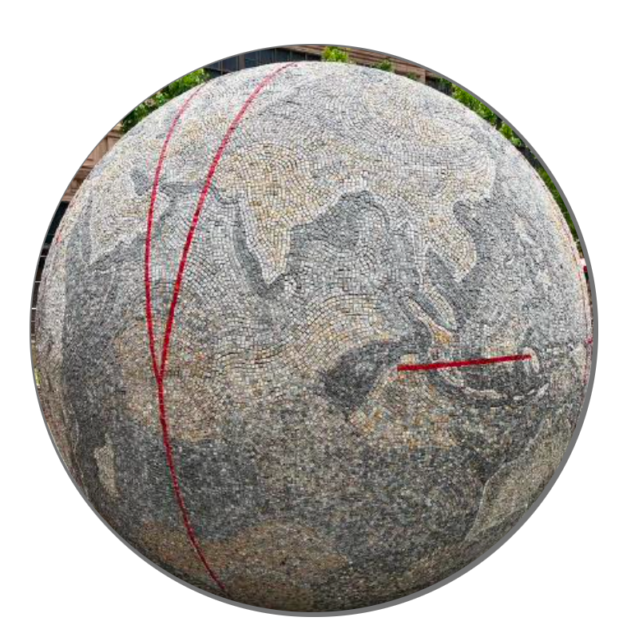</a>
    

    
<a href="https://taskswithcode.com/researchers/?author=6&name=Wele Gedara Chaminda Bandara">Wele Gedara Chaminda Bandara</a>

    
Action classification 

  </td>
  <td>
    

      
    

    
<a href="https://taskswithcode.com/researchers/?author=7&name=Haofei Xu">Haofei Xu</a>

    
Optical flow estimation

  </td>
  <td>
  </td>
    <td>
  </td>
    <td>
  </td>
</tr>
</tbody>
</table>

<a href="https://taskswithcode.ghost.io/twc-15/"> 7 – 13 Nov 2022</a>

<table>
<tbody>
<tr>
  <td>
    

      
    

    
<a href="https://taskswithcode.com/researchers/?author=8&name=Steven Walton">Steven Walton</a>

    
Image Generation

  </td>
  <td>
    

      
    

    
<a href="https://taskswithcode.com/researchers/?author=9&name=Haoning Wu">Haoning Wu</a>

    
Video Quality Assessment

  </td>
  <td>
    

      
    

    
<a href="https://taskswithcode.com/researchers/?author=10&name=Andrea Dittadi">Andrea Dittadi</a>

    
Video Prediction

  </td>
    <td>
    

      
    

    
<a href="https://taskswithcode.com/researchers/?author=11&name=Jitesh Jain">Jitesh Jain</a>

    
Instance segmentation

  </td>
</tr>
</tbody>
</table>

<a href="https://taskswithcode.ghost.io/twc-14/">31 Oct – 6 Nov 2022</a>

<table>
<tbody>
<tr>
  <td>
    

      
    

    
<a href="https://taskswithcode.com/researchers/?author=12&name=Jinhwan Seo">Jinhwan Seo</a>

    
Weakly Supervised Object Detection

  </td>
  <td>
    

      
    

    
<a href="https://taskswithcode.com/researchers/?author=13&name=Pan Lu">Pan Lu</a>

    
Science Question Answering

  </td>
  <td>
    

      
    

    
<a href="https://taskswithcode.com/researchers/?author=14&name=Felix Rosberg">Felix Rosberg</a>

    
Face Swapping

  </td>
    <td>
    

      
    

    
<a href="https://taskswithcode.com/researchers/?author=15&name=Shengjie Luo">Shengjie Luo</a>

    
Graph Regression

  </td>
    <td>
    

      
    

    
<a href="https://taskswithcode.com/researchers/?author=16&name=Wenhan Xiong">Wenhan Xiong</a>

    
Text summarization

  </td>
</tr>
<tr>
  <td>
    

      
    

    
<a href="https://taskswithcode.com/researchers/?author=17&name=Michihiro Yasunaga">Michihiro Yasunaga</a>

    
Q&A and Riddle sense

  </td>
  <td>
    

      
    

    
<a href="https://taskswithcode.com/researchers/?author=18&name=Seokju Cho">Seokju Cho</a>

    
Semantic correspondence

  </td>
  <td>
    

      
    

    
<a href="https://taskswithcode.com/researchers/?author=19&name=Guanqi Zhan">Guanqi Zhan</a>

    
Occluded Object detection

   </td>
   <td>
      

      
    

    
<a href="https://taskswithcode.com/researchers/?author=20&name=Haowei Lin">Haowei Lin</a>

    
Continual pretraining

  </td>
  </td>
    <td>
      

      
    

    
<a href="https://taskswithcode.com/researchers/?author=21&name=Tao Kong">Tao Kong</a>

    
self-supervised image classification

  </td>
</tr>
</tbody>
</table>

<a href="https://taskswithcode.ghost.io/twc/">24 Oct – 30 Oct 2022</a>

<table>
<tbody>
<tr>
  <td>
    

      
    

    
<a href="https://taskswithcode.com/researchers/?author=22&name=Nicolae-Catalin Ristea ">Nicolae-Catalin Ristea </a>

    
Anomaly detection

  </td>
  <td>
    

      
    

    
<a href="https://taskswithcode.com/researchers/?author=23&name=Lucas Jaffe">Lucas Jaffe</a>

    
Person search

  </td>
  <td>
    

      
    

    
<a href="https://taskswithcode.com/researchers/?author=24&name=Xintao Wang">Xintao Wang</a>

    
Link Prediction

  </td>
</tr>
</tbody>
</table>

<a href="https://taskswithcode.ghost.io/twc/">17 Oct – 23 Oct 2022</a>

<table>
<tbody>
<tr>
  <td>
    

      
    

    
<a href="https://taskswithcode.com/researchers/?author=25&name=Jianhao Shen">Jianhao Shen</a>

    
Link Prediction

  </td>
  <td>
    

      
    

    
<a href="https://taskswithcode.com/researchers/?author=26&name=Zhan Tong">Zhan Tong</a>

    
Action recognition

  </td>
  <td>
    

      
    

    
<a href="https://taskswithcode.com/researchers/?author=27&name=Jianwei Yang">Jianwei Yang</a>

    
Open Vocabulary Object Detection

  </td>
    <td>
    

      
    

    
<a href="https://taskswithcode.com/researchers/?author=28&name=Qin Liu">Qin Liu</a>

    
Interactive segmentation

  </td>
    <td>
    

      
    

    
<a href="https://taskswithcode.com/researchers/?author=29&name=Chen Feng">Chen Feng</a>

    
learning with noisy labels

  </td>
</tr>
</tbody>
</table>

<a href="https://taskswithcode.ghost.io/twc-11/">10 Oct – 16 Oct 2022</a>

<table>
<tbody>
<tr>
  <td>
    

      
    

    
<a href="https://taskswithcode.com/researchers/?author=30&name=Hanoona Rasheed">Hanoona Rasheed</a>

    
Open Vocabulary Object Detection

  </td>
  <td>
    

      
    

    
<a href="https://taskswithcode.com/researchers/?author=31&name=Zhendong Wang">Zhendong Wang</a>

    
Image Generation

  </td>
  <td>
    

      
    

    
<a href="https://taskswithcode.com/researchers/?author=32&name=Muhammad Uzair Khattak">Muhammad Uzair Khattak</a>

    
Prompt engineering

  </td>
    <td>
    

      
    

    
<a href="https://taskswithcode.com/researchers/?author=33&name=Yuxin Jiang"> Yuxin Jiang</a>

    
Semantic Textual Similarity

  </td>
    <td>
    

      
    

    
<a href="https://taskswithcode.com/researchers/?author=9&name=Haoning Wu">Haoning Wu</a>

    
Video Quality Assessment

  </td>
</tr>
</tbody>
</table>

<a href="https://taskswithcode.ghost.io/twc-10/">3 Oct – 9 Oct 2022</a>

<table>
<tbody>
<tr>
  <td>
    

      
    

    
<a href="https://taskswithcode.com/researchers/?author=34&name=Hung-Nghiep Tran">Hung-Nghiep Tran</a>

    
Link Prediction

  </td>
  <td>
    

      
    

    
<a href="https://taskswithcode.com/researchers/?author=35&name=Andrea Gesmundo">Andrea Gesmundo</a>

    
Generalized few-shot image  Classification

  </td>
  <td>
    

      
    

    
<a href="https://taskswithcode.com/researchers/?author=36&name=Anuj Singh">Anuj Singh</a>

    
Few-Shot Image Classification

  </td>
    <td>
    

      
    

    
<a href="https://taskswithcode.com/researchers/?author=37&name=Manuel Traub">Manuel Traub</a>

    
Video Object Tracking

  </td>
    <td>
    

      
    

    
<a href="https://taskswithcode.com/researchers/?author=38&name=Jonas Schult">Jonas Schult</a>

    
Instance Segmentation

  </td>
</tbody>
</table>

<table>
<tbody>
</tr>
  <tr>
  <td>
    

      <a href="https://taskswithcode.com/researchers/?author=39&name=Khoa Vo">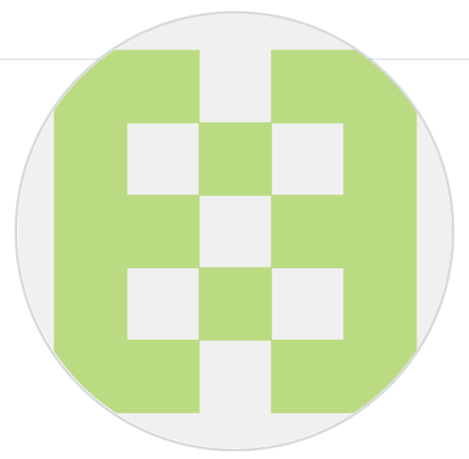</a>
    

    
<a href="https://taskswithcode.com/researchers/?author=39&name=Khoa Vo">Khoa Vo</a>

    
Temporal Action Proposal Generation

  </td>
</tr>
</tbody>
</table>

<a href="https://taskswithcode.ghost.io/twc-9-2/">26 Sept – 2 Oct 2022</a>

<table>
<tbody>
<tr>
  <td>
    

      
    

    
<a href="https://taskswithcode.com/researchers/?author=40&name=Taehun Kim">Taehun Kim</a>

    
Salient Object Detection

  </td>
  <td>
    

      <a href="https://taskswithcode.com/researchers/?author=41&name=Junyoung Son">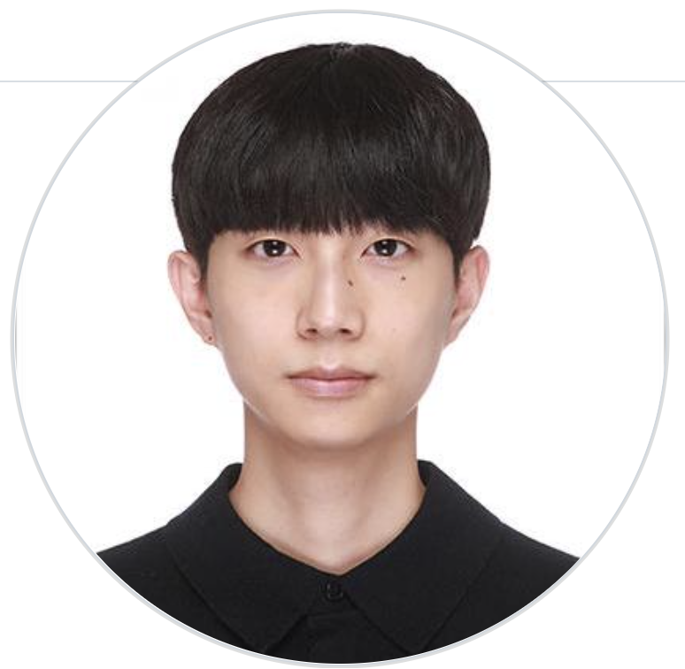</a>
    

    
<a href="https://taskswithcode.com/researchers/?author=41&name=Junyoung Son">Junyoung Son</a>

    
Dialog Relation Extraction

  </td>
  <td>
    

      <a href="https://taskswithcode.com/researchers/?author=42&name=Zhaoyang Huang">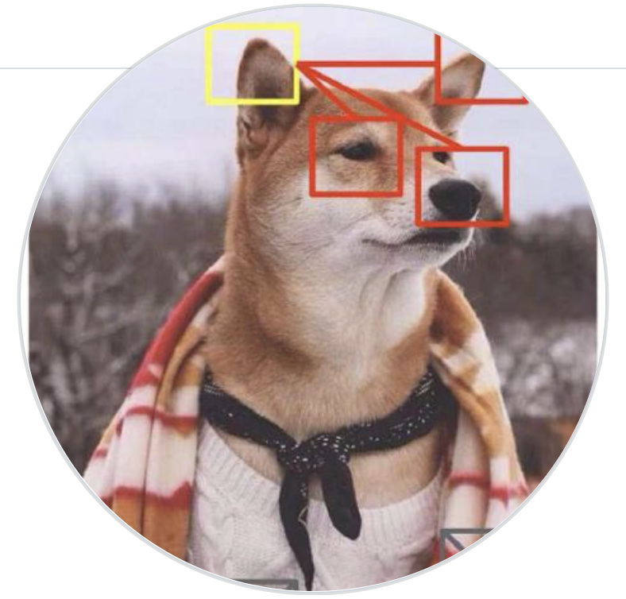</a>
    

    
<a href="https://taskswithcode.com/researchers/?author=42&name=Zhaoyang Huang">Zhaoyang Huang</a>

    
Optical flow estimation

  </td>
    <td>
    

      
    

    
<a href="https://taskswithcode.com/researchers/?author=43&name=Riccardo La Grassa">Riccardo La Grassa</a>

    
Depth Estimation

  </td>
    <td>
    

      
    

    
<a href="https://taskswithcode.com/researchers/?author=44&name=Antoine Yang">Antoine Yang</a>

    
Zero-Shot Learning

  </td>
</tbody>
</table>

<table>
<tbody>
</tr>
  <tr>
  <td>
    

      
    

    
<a href="https://taskswithcode.com/researchers/?author=45&name=Zixiang Zhou">Zixiang Zhou</a>

    
3D Object Detection

  </td>
</tr>
</tbody>
</table>

<a href="https://taskswithcode.ghost.io/twc-8/">19 Sept – 25 Sept 2022</a>

<table>
<tbody>
<tr>
  <td>
    

      <a href="https://taskswithcode.com/researchers/?author=46&name=Xiaofeng Mao">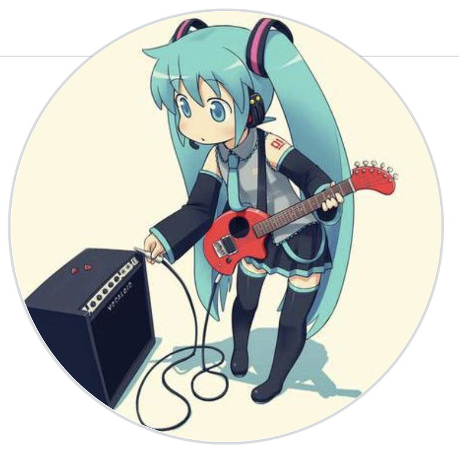</a>
    

    
<a href="https://taskswithcode.com/researchers/?author=46&name=Xiaofeng Mao">Xiaofeng Mao</a>

    
Domain Generalization

  </td>
  <td>
    

      <a href="https://taskswithcode.com/researchers/?author=47&name=Bei Liu">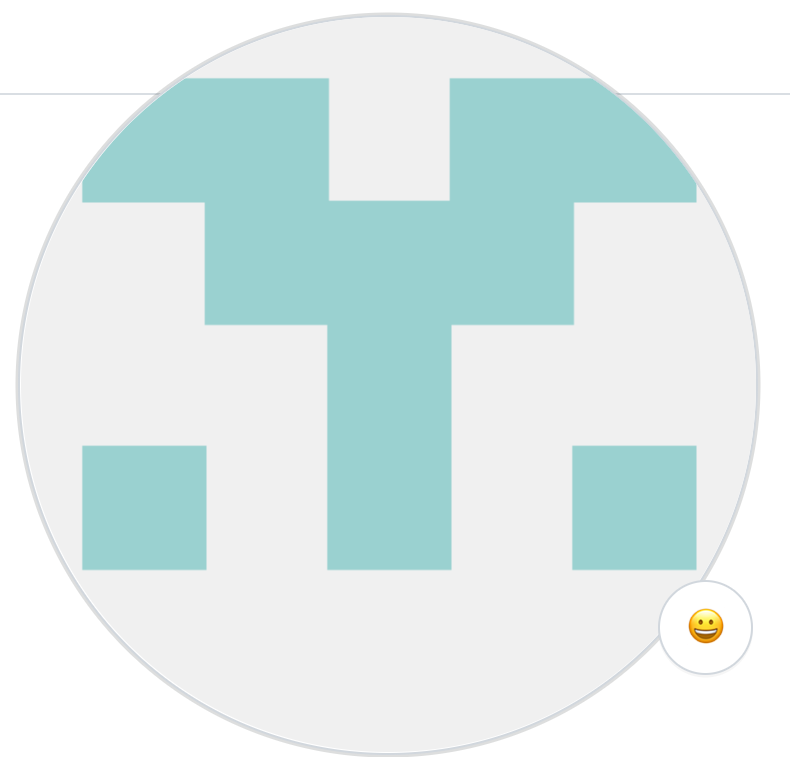</a>
    

    
<a href="https://taskswithcode.com/researchers/?author=47&name=Bei Liu">Bei Liu</a>

    
Video retrieval

  </td>
  <td>
    

      
    

    
<a href="https://taskswithcode.com/researchers/?author=48&name=Ao Zhang">Ao Zhang</a>

    
Scene graph generation

  </td>
    <td>
    

      
    

    
<a href="https://taskswithcode.com/researchers/?author=49&name=Debaditya Roy">Debaditya Roy</a>

    
next action prediction

  </td>
    <td>
    

      
    

    
<a href="https://taskswithcode.com/researchers/?author=50&name=Kaiyu Li">Kaiyu Li</a>

    
Remote sensing

  </td>
</tr>
</tbody>
</table>
<table>
<tbody>
<tr>
  <td>
    

      <a href="https://taskswithcode.com/researchers/?author=51&name=Meng-Hao Guo">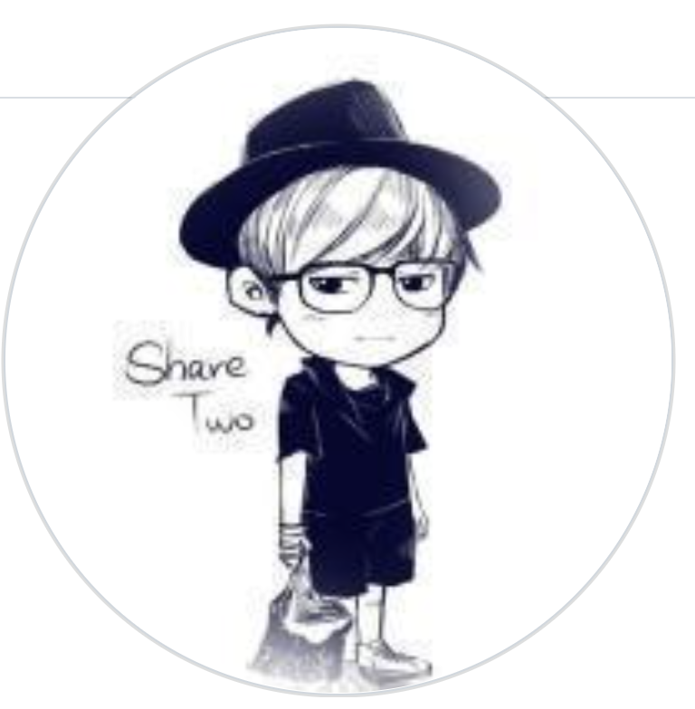</a>
    

    
<a href="https://taskswithcode.com/researchers/?author=51&name=Meng-Hao Guo">Meng-Hao Guo</a>

    
Semantic Segmentation

  </td>
  <td>
    

      
    

    
<a href="https://taskswithcode.com/researchers/?author=52&name=Max Ma">Max Ma</a>

    
Long-range modeling

  </td>
  <td>
    

      
    

    
<a href="https://taskswithcode.com/researchers/?author=53&name=Runzhong Wang">Runzhong Wang</a>

    
Graph matching

  </td>
    <td>
      

      
    

    
<a href="https://taskswithcode.com/researchers/?author=54&name=Sreenath P Kyathanahally">Sreenath P Kyathanahally</a>

    
Fine-grained image classification

  </td>
</tr>
</tbody>
</table>

<a href="https://taskswithcode.ghost.io/twc-7/">12 Sept– 18 Sept 2022</a>

<table>
<tbody>
<tr>
  <td>
    

      
    

    
<a href="https://taskswithcode.com/researchers/?author=55&name=Haobo Wang">Haobo Wang</a>

    
learning with noisy labels

  </td>
  <td>
    

      <a href="https://taskswithcode.com/researchers/?author=56&name=Kai Wu">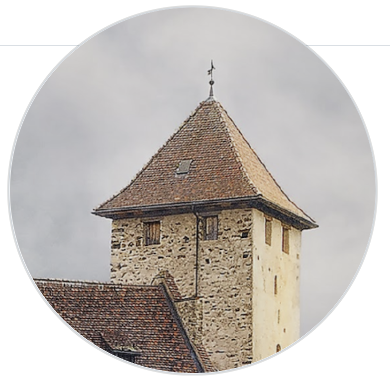</a>
    

    
<a href="https://taskswithcode.com/researchers/?author=56&name=Kai Wu">Kai Wu</a>

    
Semi-supervised image classification

  </td>
  <td>
    

      <a href="https://taskswithcode.com/researchers/?author=57&name=Lin Chen">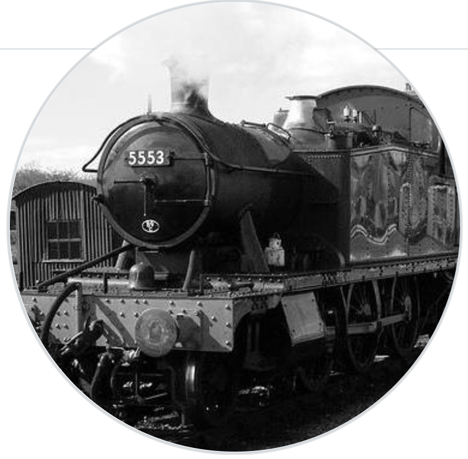</a>
    

    
<a href="https://taskswithcode.com/researchers/?author=57&name=Lin Chen">Lin Chen</a>

    
Domain Adaptation

  </td>
    <td>
    

      
    

    
<a href="https://taskswithcode.com/researchers/?author=58&name=Shell Xu Hu">Shell Xu Hu</a>

    
Few shot image classification

  </td>
    <td>
    

      
    

    
<a href="https://taskswithcode.com/researchers/?author=59&name=Daniel Shalam">Daniel Shalam</a>

    
few shot image classification

  </td>
</tr>
</tbody>
</tbody>
<table>
<tbody>
<tr>
  <td>
    

      <a href="https://taskswithcode.com/researchers/?author=60&name=Weihan Liang">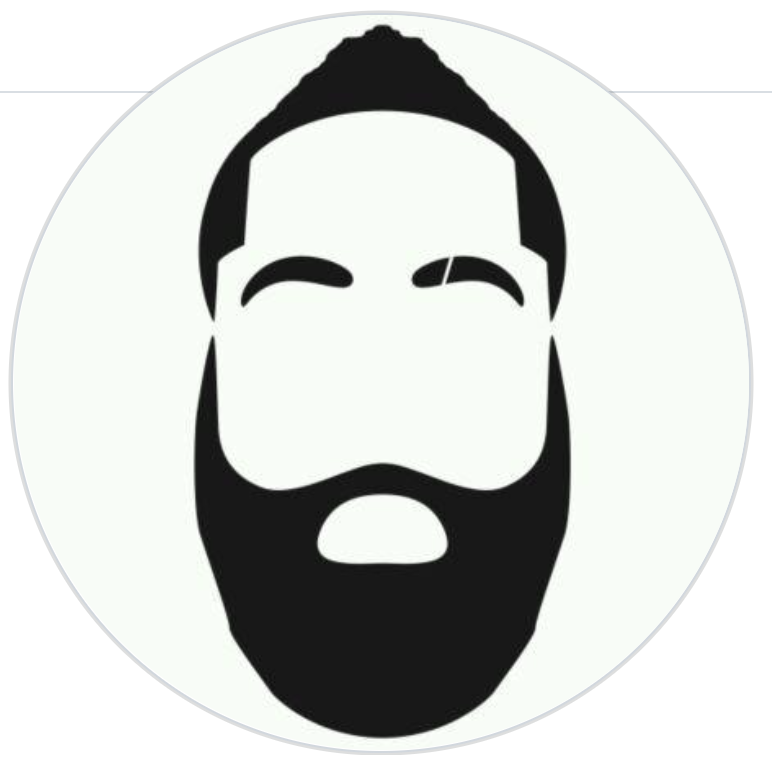</a>
    

    
<a href="https://taskswithcode.com/researchers/?author=60&name=Weihan Liang">Weihan Liang</a>

    
few-shot image classification

  </td>
</tr>
</tbody>
</table>

<a href="https://taskswithcode.ghost.io/twc-6-2/">5 Sept– 11 Sept 2022</a>

<table>
<tbody>
<tr>
  <td>
    

      
    

    
<a href="https://taskswithcode.com/researchers/?author=61&name=Zheng Guang Cong">Zheng Guang Cong</a>

    
Conditional image generation

  </td>
  <td>
    

      
    

    
<a href="https://taskswithcode.com/researchers/?author=62&name=Midhun Vayyat">Midhun Vayyat</a>

    
Synthetic-to-Real Translation

  </td>
  <td>
    

      
    

    
<a href="https://taskswithcode.com/researchers/?author=63&name=Ying-Yu Chen">Ying-Yu Chen</a>

    
Few shot image classification

  </td>
    <td>
    

      
    

    
<a href="https://taskswithcode.com/researchers/?author=64&name=Bruno Sauvalle">Bruno Sauvalle</a>

    
Unsupervised Object Segmentation

  </td>
    <td>
    

      
    

    
<a href="https://taskswithcode.com/researchers/?author=65&name=Pingchuan Ma">Pingchuan Ma</a>

    
Lipreading

  </td>
</tr>
</tbody>
<table>
<tbody>
<tr>
  <td>
    

      
    

    
<a href="https://taskswithcode.com/researchers/?author=66&name=Ho Kei Cheng">Ho Kei Cheng</a>

    
Video object segmentation

  </td>
</tr>
</tbody>
</table>

<a href="https://taskswithcode.ghost.io/twc-issue-4/">29 Aug–4 Sept 2022</a>

<table>
<tbody>
<tr>
  <td>
    

      
    

    
<a href="https://taskswithcode.com/researchers/?author=67&name=Yin Li">Yin Li</a>

    
temporal action localization

  </td>
  <td>
    

      
    

    
<a href="https://taskswithcode.com/researchers/?author=68&name=Niklas Muennighoff">Niklas Muennighoff</a>

    
Information retrieval

  </td>
  <td>
    

      
    

    
<a href="https://taskswithcode.com/researchers/?author=69&name=Chuxiong Sunn">Chuxiong Sun</a>

    
Link prediction 

  </td>
</tr>
</tbody>
</table>

<a href="https://taskswithcode.ghost.io/twc-4/">22 Aug – 28 Aug 2022</a>

<table>
<tbody>
<tr>
  <td>
    

      
    

    
<a href="https://taskswithcode.com/researchers/?author=70&name=Jianfeng Wang">Jianfeng Wang</a>

    
Image captioning

  </td>
  <td>
    

      
    

    
<a href="https://taskswithcode.com/researchers/?author=71&name=Jianfeng Wang">Jia Cheng Hu</a>

    
Image captioning

  </td>
  <td>
    

      <a href="https://taskswithcode.com/researchers/?author=72&name=Li Dong">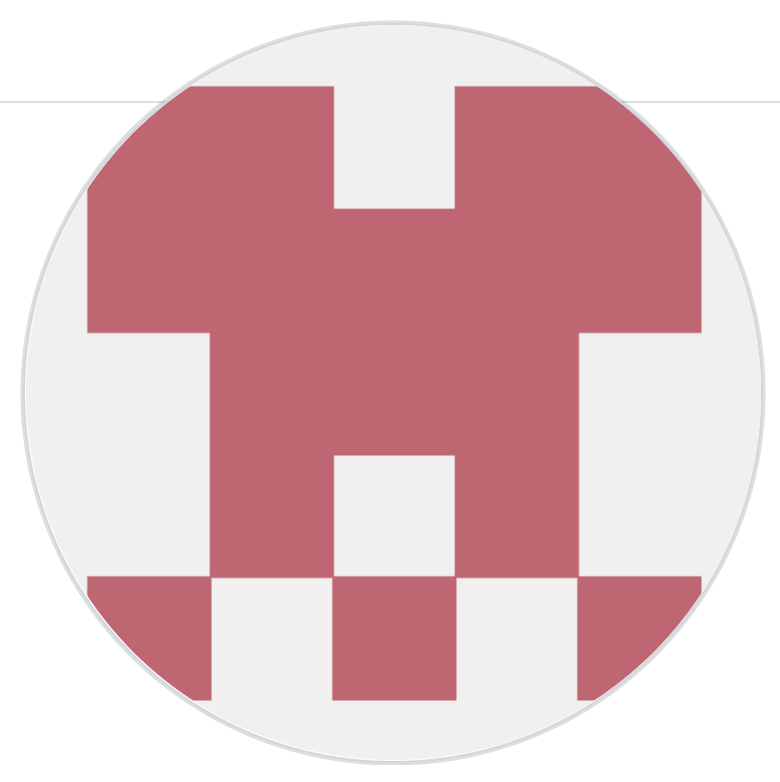</a>
    

    
<a href="https://taskswithcode.com/researchers/?author=72&name=Li Dong">Li Dong</a>

    
Visual Q&A

  </td>
    <td>
    

      
    

    
<a href="https://taskswithcode.com/researchers/?author=73&name=Yuheng Shi">Yuheng Shi</a>

    
Video Object detection

  </td>
  <td>
    

      
    

    
<a href="https://taskswithcode.com/researchers/?author=74&name=Lei Sun">Lei Sun</a>

    
Motion Blur removal

  </td>
</tr>
</tbody>
</table>
<table>
<tbody>
<tr>
  <td>
    

      <a href="https://taskswithcode.com/researchers/?author=75&name=Jho-Yonsei">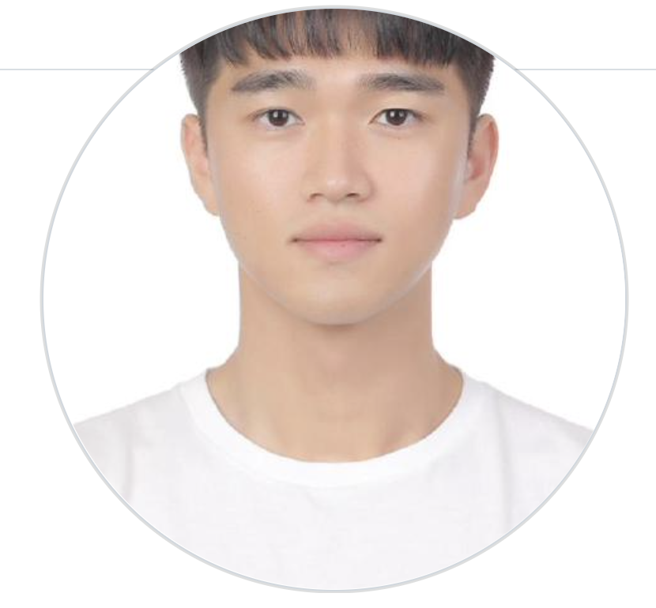</a>
    

    
<a href="https://taskswithcode.com/researchers/?author=75&name=Jho-Yonsei">Jho-Yonsei</a>

    
Skeleton based action recognition

  </td>
  <td>
    

      <a href="https://taskswithcode.com/researchers/?author=76&name=Di Wang">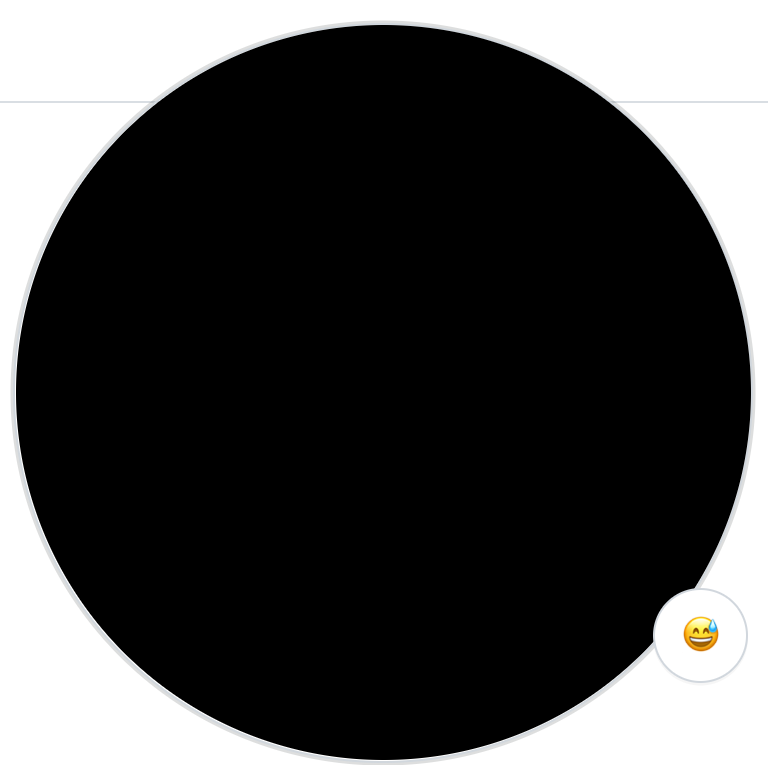</a>
    

    
<a href="https://taskswithcode.com/researchers/?author=76&name=Di Wang">Di Wang</a>

    
Semantic segmentation

  </td>
  <td>
    

      
    

    
<a href="https://taskswithcode.com/researchers/?author=77&name=Tom Ayoola">Tom Ayoola</a>

    
Entity typing

  </td>
  <td>
    

      
    

    
<a href="https://taskswithcode.com/researchers/?author=78&name=Andrey Savchenko">Andrey Savchenko</a>

    
Facial expression recognition

  </td>
</tbody>
</table>

<a href="https://taskswithcode.ghost.io/twc-3/">15 – 21 August 2022</a>

<table>
<tbody>
<tr>
  <td>
    

      <a href="https://taskswithcode.com/researchers/?author=79&name=Jianggang Zhu">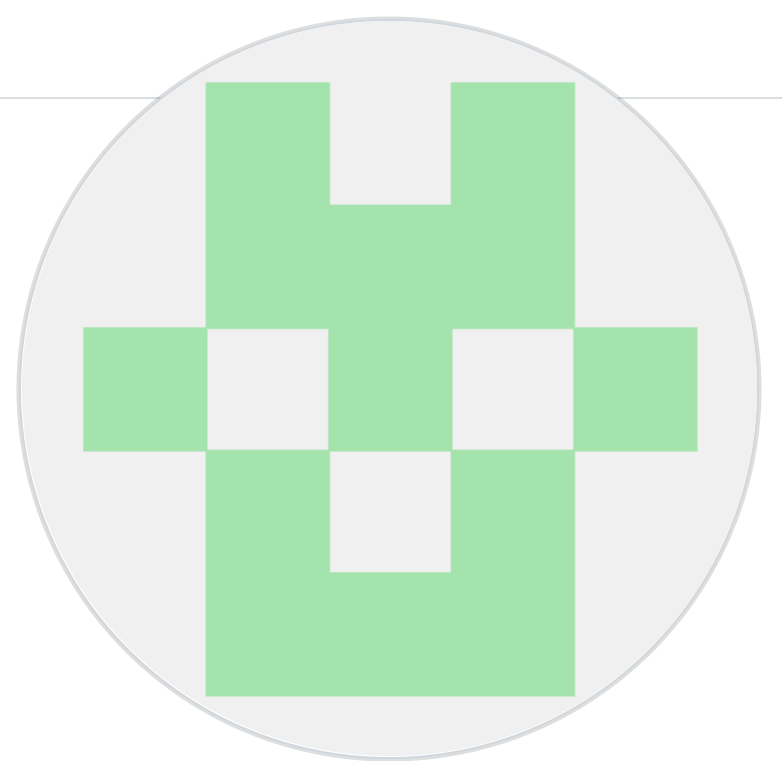</a>
    

    
<a href="https://taskswithcode.com/researchers/?author=79&name=Jianggang Zhu">Jianggang Zhu</a>

    
Long tail learning

  </td>
  <td>
    

      
    

    
<a href="https://taskswithcode.com/researchers/?author=80&name=Lianyu Hu">Lianyu Hu</a>

    
Skeleton based action recognition

  </td>
  <td>
    

      
    

    
<a href="https://taskswithcode.com/researchers/?author=81&name=Sanghyun Jo">Sanghyun Jo</a>

    
Weakly supervised semantic segmentation

  </td>
    <td>
    

      
    

    
<a href="https://taskswithcode.com/researchers/?author=82&name=Edward Sanderson">Edward Sanderson</a>

    
Medical Image Segmentation

  </td>
  <td>
    

      
    

    
<a href="https://taskswithcode.com/researchers/?author=83&name=Jin-Hwa Kim">Jin-Hwa Kim</a>

    
Unsupervised anomaly detection

  </td>
</tr>
</tbody>
</table>
<table>
<tbody>
<tr>
  <td>
    

      
    

    
<a href="https://taskswithcode.com/researchers/?author=84&name=Yuyuan Liu">Yuyuan Liu</a>

    
Supervised anomaly detection

  </td>
  <td>
    

      <a href="https://taskswithcode.com/researchers/?author=85&name=ME495">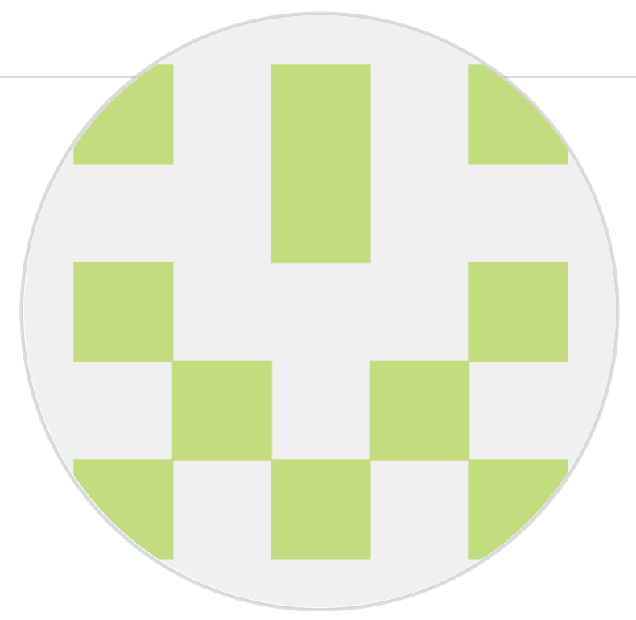</a>
    

    
<a href="https://taskswithcode.com/researchers/?author=85&name=ME495">ME495</a>

    
Hand Pose estimation

  </td>
</tbody>
</table>

  

<a href="https://taskswithcode.ghost.io/twc-issue-2/">8 – 14 August 20222</a>

  
<table>
<tbody>
<tr>
  <td>
    

      
    

    
<a href="https://taskswithcode.com/researchers/?author=86&name=Jingyun Liang">Jingyun Liang</a>

    
Video restoration

  </td>
  <td>
    

      
    

    
<a href="https://taskswithcode.com/researchers/?author=87&name=Zhendong Wang">Zhendong Wang</a>

    
Image Deblurring

  </td>
  <td>
    

      
    

    
<a href="https://taskswithcode.com/researchers/?author=88&name=Yinxiao Li">Yinxiao Li</a>

    
Image Deblurring

  </td>
    <td>
    

      <a href="https://taskswithcode.com/researchers/?author=89&name=MartinXM">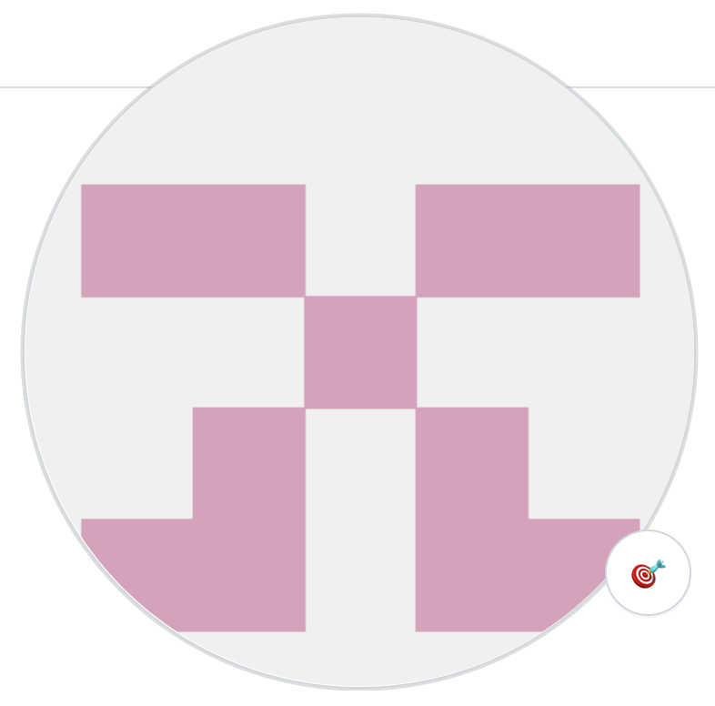</a>
    

    
<a href="https://taskswithcode.com/researchers/?author=89&name=MartinXM">MartinXM</a>

    
Action recognition in videos

  </td>
  <td>
    

      
    

    
<a href="https://taskswithcode.com/researchers/?author=90&name=Ethan Yuxuan Wang">Ethan Yuxuan Wang</a>

    
Boundary grounding and captioning in videos

  </td>
</tr>
</tbody>
</table>
  
 <table>
<tbody>
<tr>
  <td>
    

      
    

    
<a href="https://taskswithcode.com/researchers/?author=91&name=Zhengyang Geng">Zhengyang Geng</a>

    
Optical flow estimation

  </td>
  <td>
    

      
    

    
<a href="https://taskswithcode.com/researchers/?author=92&name=Ozan Unal">Ozan Unal</a>

    
Video and image semantic segmentation

  </td>
  <td>
    

      
    

    
<a href="https://taskswithcode.com/researchers/?author=93&name=Jiannan Wu">Jiannan Wu</a>

    
Language as queries for referring to video object segmentation

  </td>
    <td>
    

      
    

    
<a href="https://taskswithcode.com/researchers/?author=94&name=Lukas Hoyer">Lukas Hoyer</a>

    
Image semantic segmentation

  </td>
  <td>
    

      
    

    
<a href="https://taskswithcode.com/researchers/?author=95&name=Jianxun Lou">Jianxun Lou</a>

    
Saliency Prediction

  </td>
</tr>
</tbody>
</table>
  
 <table>
<tbody>
<tr>
  <td>
    

      
    

    
<a href="https://taskswithcode.com/researchers/?author=96&name=Wojciech Zielonka">Wojciech Zielonka</a>

    
3D face reconstruction

  </td>
  <td>
    

      
    

    
<a href="https://taskswithcode.com/researchers/?author=97&name=Xiangyu Chen">Xiangyu Chen</a>

    
SVideo and Image super resolution

  </td>
  <td>
    

      
    

    
<a href="https://taskswithcode.com/researchers/?author=98&name=Peter H Charlton">Peter H Charlton</a>

    
Heart beat detection and rate estimation

  </td>
    <td>
    

      
    

    
<a href="https://taskswithcode.com/researchers/?author=99&name=Ge Zhu">Ge Zhu</a>

    
Sound event localization and detection

  </td>
</tr>
</tbody>
</table>
  
  
  
  

 

<a href="https://taskswithcode.ghost.io/twc-issue-1-2/">5 – 7 August 2022</a>

<a href="https://taskswithcode.ghost.io/twc-issue-1-2/">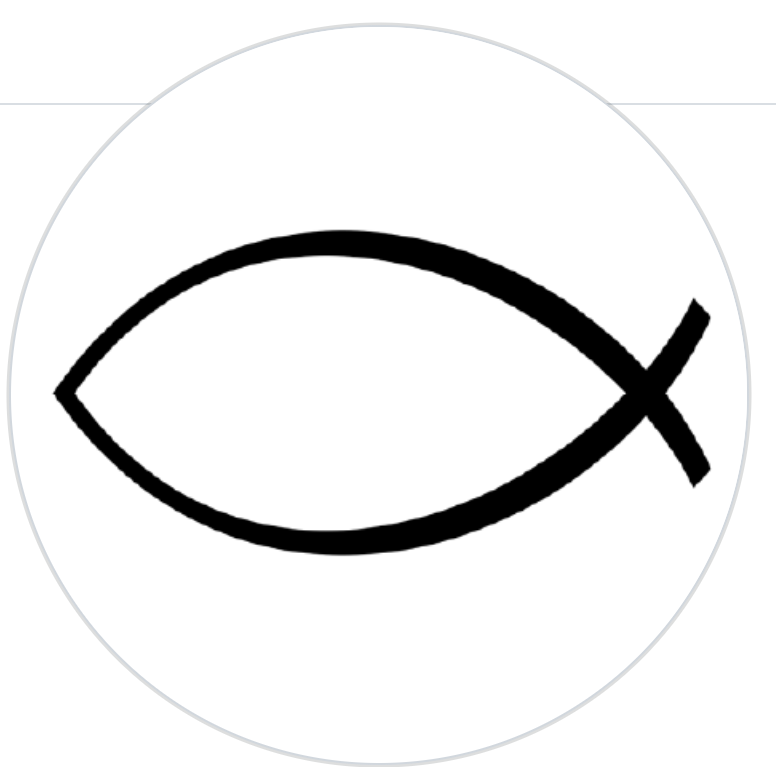
<a href="https://taskswithcode.ghost.io/twc-issue-1-2/">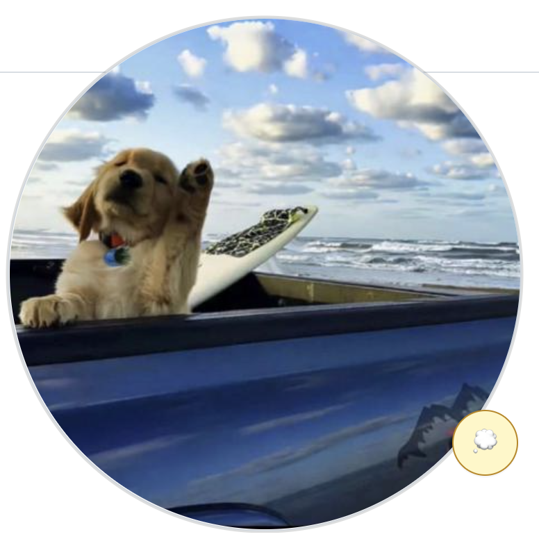</a>

</a>

 
 

##### _Apologies in advance in case we missed a SOTA paper published with code for the date ranges above. If so, please email us at [twc@taskswithcode.com](mailto:twc@taskswithcode.com?subject=[GitHub]%20Missing%20mention)_
 

