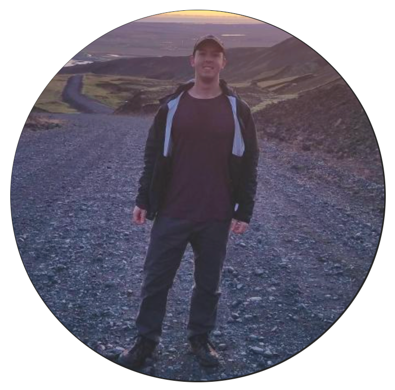

### SOTA researchers who published code _(from Aug 2022)_
These researchers produced state-of-the-art work breaking existing records on  benchmarks. They also
- authored their paper
- released their code
- released models in most cases
- released notebooks/demo apps in few cases

_Images below are Github profile photos of featured SOTA researchers_

<a href="https://taskswithcode.ghost.io/twc-16/"> 14 – 20 Nov 2022</a>

<table>
<tbody>
<tr>
  <td>
    

      
    

    
<a href="https://taskswithcode.com/researchers/?author=1&name=Xingqian Xu">Xingqian Xu</a>

    
Image Inpainting

  </td>
  <td>
    

      
    

    
<a href="https://taskswithcode.com/researchers/?author=2&name=Yuxin Fang">Yuxin Fang</a>

    
Image segmentation

  </td>
  <td>
    

      
    

    
<a href="https://taskswithcode.com/researchers/?author=3&name=Patrick Lewis">Patrick Lewis</a>

    
Question Answering

  </td>
    <td>
    

      
    

    
<a href="https://taskswithcode.com/researchers/?author=4&name=Yuang Zhang">Yuang Zhang</a>

    
Multi-Object Tracking 

  </td>
    <td>
    

      
    

    
<a href="https://taskswithcode.com/researchers/?author=5&name=Kunchang Li">Kunchang Li</a>

    
Action recognition

  </td>
</tr>
<tr>
  <td>
    

      
    

    
<a href="https://taskswithcode.com/researchers/?author=6&name=Wele Gedara Chaminda Bandara">Wele Gedara Chaminda Bandara</a>

    
Action classification 

  </td>
  <td>
    

      
    

    
<a href="https://taskswithcode.com/researchers/?author=7&name=Haofei Xu">Haofei Xu</a>

    
Optical flow estimation

  </td>
  <td>
  </td>
    <td>
  </td>
    <td>
  </td>
</tr>
</tbody>
</table>

<a href="https://taskswithcode.ghost.io/twc-15/"> 7 – 13 Nov 2022</a>

<table>
<tbody>
<tr>
  <td>
    

      
    

    
<a href="https://taskswithcode.com/researchers/?author=8&name=Steven Walton">Steven Walton</a>

    
Image Generation

  </td>
  <td>
    

      
    

    
<a href="https://taskswithcode.com/researchers/?author=9&name=Haoning Wu">Haoning Wu</a>

    
Video Quality Assessment

  </td>
  <td>
    

      
    

    
<a href="https://taskswithcode.com/researchers/?author=10&name=Andrea Dittadi">Andrea Dittadi</a>

    
Video Prediction

  </td>
    <td>
    

      
    

    
<a href="https://taskswithcode.com/researchers/?author=11&name=Jitesh Jain">Jitesh Jain</a>

    
Instance segmentation

  </td>
</tr>
</tbody>
</table>

<a href="https://taskswithcode.ghost.io/twc-14/">31 Oct – 6 Nov 2022</a>

<table>
<tbody>
<tr>
  <td>
    

      
    

    
<a href="https://taskswithcode.com/researchers/?author=12&name=Jinhwan Seo">Jinhwan Seo</a>

    
Weakly Supervised Object Detection

  </td>
  <td>
    

      
    

    
<a href="https://taskswithcode.com/researchers/?author=13&name=Pan Lu">Pan Lu</a>

    
Science Question Answering

  </td>
  <td>
    

      
    

    
<a href="https://taskswithcode.com/researchers/?author=14&name=Felix Rosberg">Felix Rosberg</a>

    
Face Swapping

  </td>
    <td>
    

      
    

    
<a href="https://taskswithcode.com/researchers/?author=15&name=Shengjie Luo">Shengjie Luo</a>

    
Graph Regression

  </td>
    <td>
    

      
    

    
<a href="https://taskswithcode.com/researchers/?author=16&name=Wenhan Xiong">Wenhan Xiong</a>

    
Text summarization

  </td>
</tr>
<tr>
  <td>
    

      
    

    
<a href="https://taskswithcode.com/researchers/?author=17&name=Michihiro Yasunaga">Michihiro Yasunaga</a>

    
Q&A and Riddle sense

  </td>
  <td>
    

      
    

    
<a href="https://taskswithcode.com/researchers/?author=18&name=Seokju Cho">Seokju Cho</a>

    
Semantic correspondence

  </td>
  <td>
    

      
    

    
<a href="https://taskswithcode.com/researchers/?author=19&name=Guanqi Zhan">Guanqi Zhan</a>

    
Occluded Object detection

   </td>
   <td>
      

      
    

    
<a href="https://taskswithcode.com/researchers/?author=20&name=Haowei Lin">Haowei Lin</a>

    
Continual pretraining

  </td>
  </td>
    <td>
      

      
    

    
<a href="https://taskswithcode.com/researchers/?author=21&name=Tao Kong">Tao Kong</a>

    
self-supervised image classification

  </td>
</tr>
</tbody>
</table>

<a href="https://taskswithcode.ghost.io/twc/">24 Oct – 30 Oct 2022</a>

<table>
<tbody>
<tr>
  <td>
    

      
    

    
<a href="https://taskswithcode.com/researchers/?author=22&name=Nicolae-Catalin Ristea ">Nicolae-Catalin Ristea </a>

    
Anomaly detection

  </td>
  <td>
    

      
    

    
<a href="https://taskswithcode.com/researchers/?author=23&name=Lucas Jaffe">Lucas Jaffe</a>

    
Person search

  </td>
  <td>
    

      
    

    
<a href="https://taskswithcode.com/researchers/?author=24&name=Xintao Wang">Xintao Wang</a>

    
Link Prediction

  </td>
</tr>
</tbody>
</table>

<a href="https://taskswithcode.ghost.io/twc/">17 Oct – 23 Oct 2022</a>

<table>
<tbody>
<tr>
  <td>
    

      
    

    
<a href="https://taskswithcode.com/researchers/?author=25&name=Jianhao Shen">Jianhao Shen</a>

    
Link Prediction

  </td>
  <td>
    

      
    

    
<a href="https://taskswithcode.com/researchers/?author=26&name=Zhan Tong">Zhan Tong</a>

    
Action recognition

  </td>
  <td>
    

      
    

    
<a href="https://taskswithcode.com/researchers/?author=27&name=Jianwei Yang">Jianwei Yang</a>

    
Open Vocabulary Object Detection

  </td>
    <td>
    

      
    

    
<a href="https://taskswithcode.com/researchers/?author=28&name=Qin Liu">Qin Liu</a>

    
Interactive segmentation

  </td>
    <td>
    

      
    

    
<a href="https://taskswithcode.com/researchers/?author=29&name=Chen Feng">Chen Feng</a>

    
learning with noisy labels

  </td>
</tr>
</tbody>
</table>

<a href="https://taskswithcode.ghost.io/twc-11/">10 Oct – 16 Oct 2022</a>

<table>
<tbody>
<tr>
  <td>
    

      
    

    
<a href="https://taskswithcode.com/researchers/?author=30&name=Jianhao Shen">Jianhao Shen</a>

    
Open Vocabulary Object Detection

  </td>
  <td>
    

      
    

    
<a href="https://taskswithcode.com/researchers/?author=31&name=Zhendong Wang">Zhendong Wang</a>

    
Image Generation

  </td>
  <td>
    

      
    

    
<a href="https://taskswithcode.com/researchers/?author=32&name=Muhammad Uzair Khattak">Muhammad Uzair Khattak</a>

    
Prompt engineering

  </td>
    <td>
    

      
    

    
<a href="https://taskswithcode.com/researchers/?author=33&name= Yuxin Jiang"> Yuxin Jiang</a>

    
Semantic Textual Similarity

  </td>
    <td>
    

      
    

    
<a href="https://taskswithcode.com/researchers/?author=9&name=Haoning Wu">Haoning Wu</a>

    
Video Quality Assessment

  </td>
</tr>
</tbody>
</table>

 

<a href="https://taskswithcode.ghost.io/twc-10/">3 Oct – 9 Oct 2022</a>

 

<a href="https://taskswithcode.ghost.io/twc-9-2/">26 Sept – 2 Oct 2022</a>

 

<a href="https://taskswithcode.ghost.io/twc-8/">19 Sept – 25 Sept 2022</a>

 

<a href="https://taskswithcode.ghost.io/twc-7/">12 Sept– 18 Sept 2022</a>

 

<a href="https://taskswithcode.ghost.io/twc-6-2/">5 Sept– 11 Sept 2022</a>

 

<a href="https://taskswithcode.ghost.io/twc-issue-4/">29 Aug–4 Sept 2022</a>

 

<a href="https://taskswithcode.ghost.io/twc-4/">22 Aug – 28 Aug 2022</a>

 

<a href="https://taskswithcode.ghost.io/twc-3/">15 – 21 August 2022</a>

 

<a href="https://taskswithcode.ghost.io/twc-issue-2/">8 – 14 August 20222</a>

 

<a href="https://taskswithcode.ghost.io/twc-issue-1-2/">5 – 7 August 2022</a>

<a href="https://taskswithcode.ghost.io/twc-issue-1-2/">

</a>

 
 

##### _Apologies in advance in case we missed a SOTA paper published with code for the date ranges above. If so, please email us at [twc@taskswithcode.com](mailto:twc@taskswithcode.com?subject=[GitHub]%20Missing%20mention)_
 

